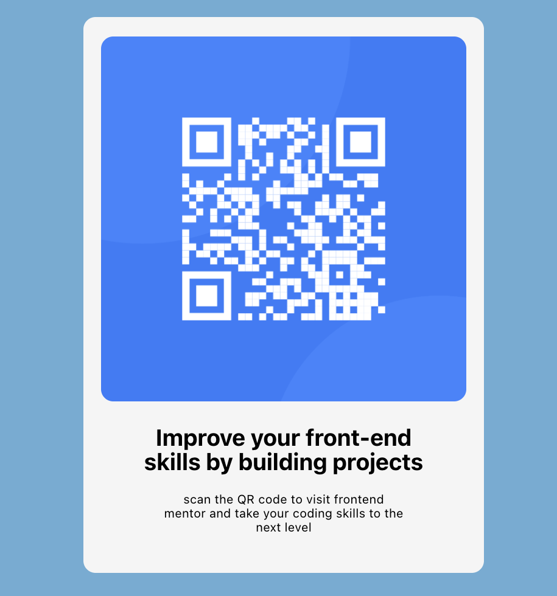

# Frontend Mentor - QR code component solution

This is a solution to the [QR code component](https://www.frontendmentor.io/challenges/qr-code-component-iux_sIO_H)

## Table of contents

- [Overview](#overview)
  - [Screenshot](#screenshot)
  - [Links](#links)
- [My process](#my-process)
  - [Built with](#built-with)
  - [Useful resources](#useful-resources)
- [Author](#author)
- [Acknowledgments](#acknowledgments)

## Overview

- This challenge provides a stepping stone for me to step out of tutorial purgatory, and get more practice with the tools & concepts I have been learning.

### Screenshot

### Links

- [QR code component](https://qr-component-one.vercel.app/)

### Built with

- Semantic HTML5 markup
- CSS custom properties
- Flexbox
- Mobile-first workflow
- [React](https://reactjs.org/) - JS library (This project was bootstrapped with [Create React App](https://github.com/facebook/create-react-app))

### Useful resources

- [Scrimba](https://scrimba.com/learn/learnreact) - This platform provided me with an opportunity to learn react for free
- [React](https://reactjs.org/) - This is an amazing web page provides you all the resources you need to put together to get your react app working perfectly on your local machine

## Author

- Github - [@soji](https://github.com/soji-opa)

## Acknowledgments

I am very grateful to Smug & Openwell for always making time out of their busy schedules to see to my coding challenges and providing me with extra motivation.
